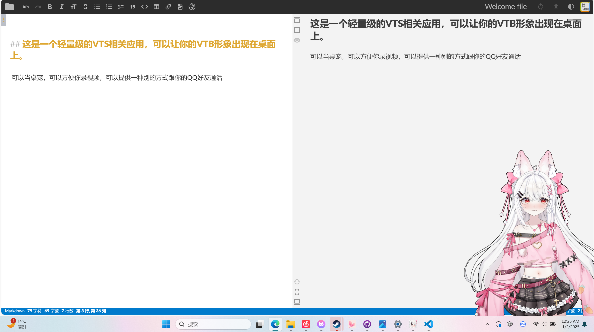

## 这是一个轻量级的VTS相关应用，可以让你的VTB形象出现在桌面上。

  

可以当桌宠，可以方便你录视频，可以提供一种别的方式跟你的QQ好友通话

右键窗口或右下角托盘的图标来呼出菜单

  

目前这个项目实现透明度的方案是基于去除背景。我实现了两种背景去除方式，绿色和黑色。同时可以在右键菜单中控制背景去除的强度。

实现过程中加入了一点小Hack，减少了人物像素误判为背景的可能，对边界处理也更好了。

  

我尝试了很多.net的库，但是它们要么不支持摄像机传入透明度信息(比如DirectShow)，要么检测不到VTS的虚拟摄像机（比如MediaFundation，EmguCV）。

如果有大佬知道怎么才能获取到VTS的虚拟摄像头，同时可以传入透明度信息，请教教我。

  

现在的实现方式是基于DirectShow，由于要实时对每一帧去除背景，以及不会视频解码，尽管我写背景去除算法比较简单，~~但仍然创造了与软件大小不匹配的CPU占有率~~（~~以及跑不满的帧率~~

  

*icon和readme中出现的live2D形象的作者是 “糖糖锦鲤：”*